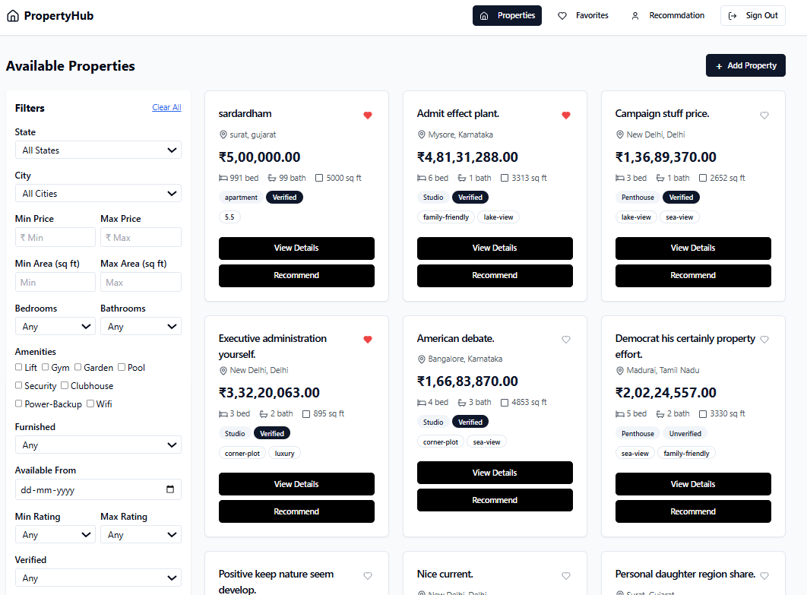
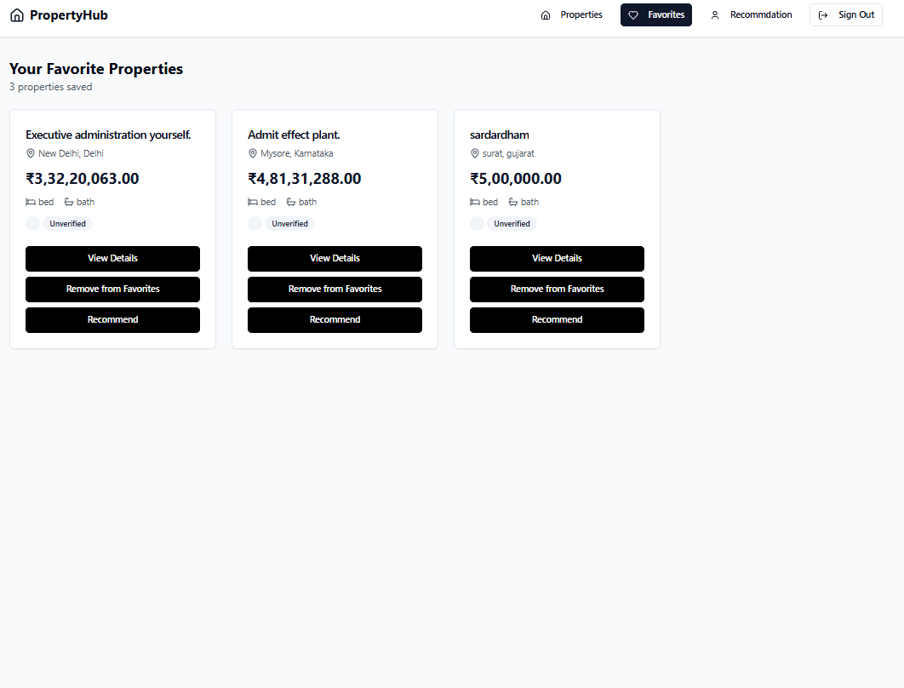
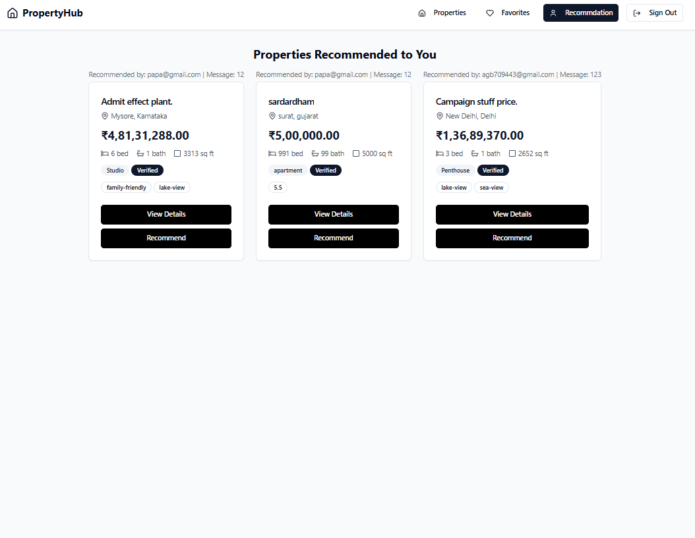

**Property Hub** is a modern, property listing and management platform.  
It enables users to browse, filter, favorite, recommend, and manage real estate properties with advanced features, robust authentication, and a beautiful UI.

---

## 🚀 Features

- **User Authentication:** Secure registration & login with JWT.
- **Property Listings:** Add, edit, delete, and view properties.
- **Advanced Filtering:** Filter by location, price, area, amenities, and more.
- **Favorites:** Save and manage your favorite properties.
- **Recommendations:** Recommend properties to other users by email.
- **Pagination:** Efficient property browsing.
- **Admin Controls:** Only owners can edit/delete their listings.
- **Backend Caching:** Redis-powered for fast data access.
- **Responsive Design:** Works on desktop & mobile.
- **Robust Validation:** Frontend & backend validation for all forms.
- **Production-Ready:** Deployed on Render (backend) and Vercel (frontend).

---

## 🌐 Live Demo

- **Frontend:** [hypergro-ai-frontend.vercel.app](https://hypergro-ai-frontend.vercel.app/)
- **Backend API:** [hypergro-ai-backend1.onrender.com](https://hypergro-ai-backend1.onrender.com/)

---

## 🛠️ Tech Stack

- **Frontend:** React, TypeScript, Vite, Tailwind CSS, React Router
- **Backend:** Node.js, Express.js, MongoDB (Mongoose), Redis (Upstash)
- **Authentication:** JWT
- **Deployment:** Vercel (frontend), Render (backend), Upstash Redis (cache)

---

## 📦 Getting Started

### 1. Clone the Repository
```bash
git clone https://github.com/Alecxender1402/Hypergro_assignment_SDE1.git
```

### 2. Backend Setup
```bash
cd server
cp .env.example .env # Create your .env file and fill in the variables below
npm install
npm start
```

**Sample `.env` for backend:**
```bash
MONGO_URI=your_mongodb_connection_string
JWT_SECRET=your_jwt_secret
JWT_EXPIRES_IN=1d
UPSTASH_REDIS_URL=your_upstash_redis_rest_url
UPSTASH_REDIS_TOKEN=your_upstash_redis_token
REDIS_TTL=3600
REDIS_HOST=localhost
REDIS_PORT=6379
REDIS_PASSWORD=
DEBUG=ioredis:*
```

### 3. Frontend Setup
```bash
cd client
cp .env.example .env # Create your .env file and fill in the variable below
change services/api.ts - API_BASE_URL
npm install
npm run dev
```


---

## 🔑 API Endpoints

| Method | Endpoint                                 | Description                           |
|--------|------------------------------------------|---------------------------------------|
| POST   | `/api/auth/register`                     | Register new user                     |
| POST   | `/api/auth/login`                        | Login and receive JWT                 |
| GET    | `/api/properties`                        | Get/filter properties (paginated)     |
| POST   | `/api/properties/create`                 | Add new property (auth required)      |
| PUT    | `/api/properties/:id`                    | Edit property (owner only)            |
| DELETE | `/api/properties/:id`                    | Delete property (owner only)          |
| POST   | `/api/favorites`                         | Add to favorites                      |
| GET    | `/api/favorites`                         | List favorites                        |
| DELETE | `/api/favorites/:id`                     | Remove from favorites                 |
| POST   | `/api/recommendations`                   | Recommend property to user by email   |
| GET    | `/api/recommendations/received`          | View received recommendations         |

---

## 📝 Usage

- **Register/Login:** Create an account or log in.
- **Browse Properties:** Use filters to find properties.
- **Favorites:** Click the heart icon to save/unsave properties.
- **Recommend:** Click "Recommend" to share a property with another user.
- **Edit/Delete:** Only the property owner can edit or delete their listing.
- **View Details:** Click "View Details" for full property info.

---

## 👨‍💻 Development Scripts

| Command         | Description               |
|-----------------|--------------------------|
| `npm run dev`   | Start development server |
| `npm run build` | Build for production     |
| `npm start`     | Start production server  |
| `npm test`      | Run tests                |

---
## image






**Enjoy Property Hub! 🚀**

